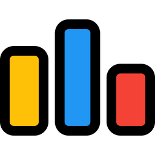

<h1 align="center">Hi 👋, I'm Bhaskar Nandy</h1>
<h3 align="center">SWE @ICRA Analytics Ltd. | Specialist (1516) @Codeforces | Knight (2059) @Leetcode | BCA'22 + MCA'24</h3>

<!-- - 👨‍💻 I’m currently working on my personal project *<a href="https://github.com/bhaskar4k/Streaming-App">Streaming App</a>* -->

- 👨‍💻 [My Portfolio](https://bhaskarnandylife.vercel.app/)

- 📫 Email ID : *bhaskarndy@gmail.com*

- 🤖 Currently, I'm building [She ++ (A Programming Language)](https://she-plus-plus.vercel.app/)

<!-- - 📄 Know about my experiences [https://drive.google.com/file/d/1m3OREySmds5GBxjZeJT6ybAChAK8bGN0/view](https://drive.google.com/file/d/1m3OREySmds5GBxjZeJT6ybAChAK8bGN0/view) -->

<h3 align="left">Connect with me:</h3>

    
    
    
    
    

